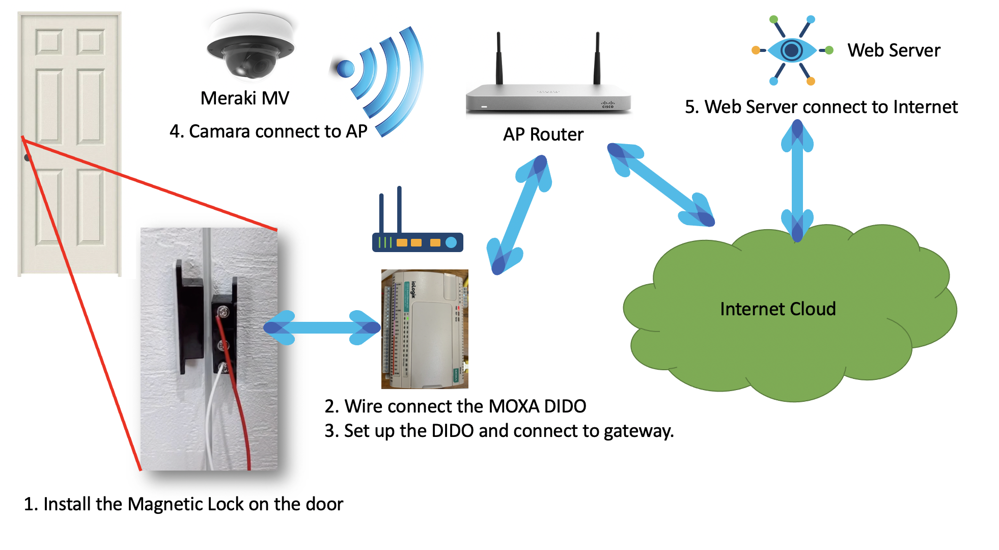
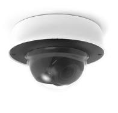
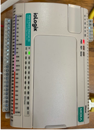
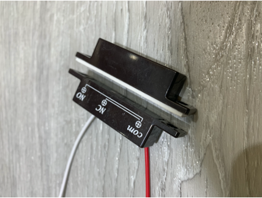
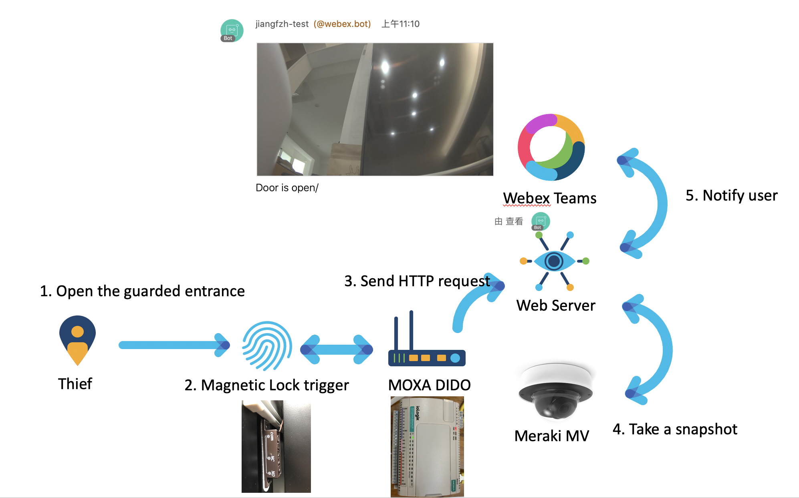
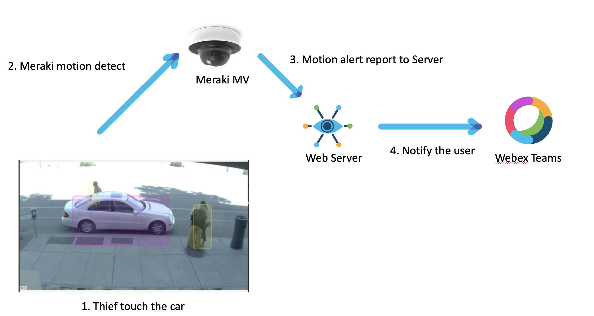

Door-Connect
=====
Door-Connect is the IOT platform for door application.
It will bridge IOT device, IM tool (WebexTeams) and Cloud application. <br />
In this platform, user can monitor the door environment and even get notify when environment change.

Most Enterprises has some confidential places such as file room, operation room, data center and so on. <br />
They need a good solution which can control and record staff who and when enters these kind of rooms. When there is something happened, they need a simple tool which can provide much more visibility and trace back easily.

The platform is base on Meriki MV, Webex Teams and MOXA DIDO hardware and our software integration platform.
The aim is provide the integration server for IOT door application.

# Getting Started
There are some hardware equipment and software need to prepare.
* Environment Setup
    <p align=center>
    
    </p>
* Hardware Component
    * A Door
    * A Web Server with network.
    *  Meriki Camara
        <p align=center>
        
        </p>
    *  MOXA DIDO: IOT connect device
        <p align=center>
        
        </p>
    *  Magnetic lock:
        <p align=center>
        
        </p>

* Software Dependencies on Webserver
    * python3 
    * Flask : Lite weight web server framwork
    * Installation
        ```bash
        pip install python3
        python3 IOT_Meraki_DevNet.py
        ```
## Demo Topology
* **Use case1: Who open the door?**
    <p align=center>
    
    </p>
* **Use case2: WHO TOUCH MY BELONGINGS?**
    <p align=center>
    
    </p>
## How it works

MOXA Switch detect IOT device's alarm info and send message to Door-Connect webserver.

Door-Connect webserver is triggered to get snapshot from Meraki camera.

Door-Connect webserver send both IOT info and camera snapshot to Door-Connect tool.

The Python part server as Door-Connect webserver.


## License

 is freely redistributable under the BSD 2 clause license. Use of
this source code is governed by a BSD-style license that can be found in the
LICENSE file.

